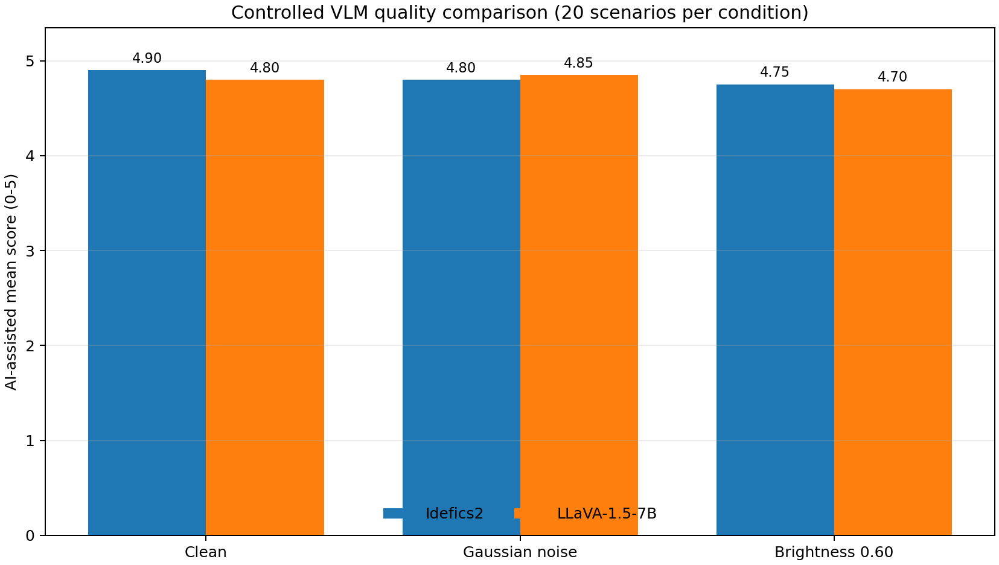
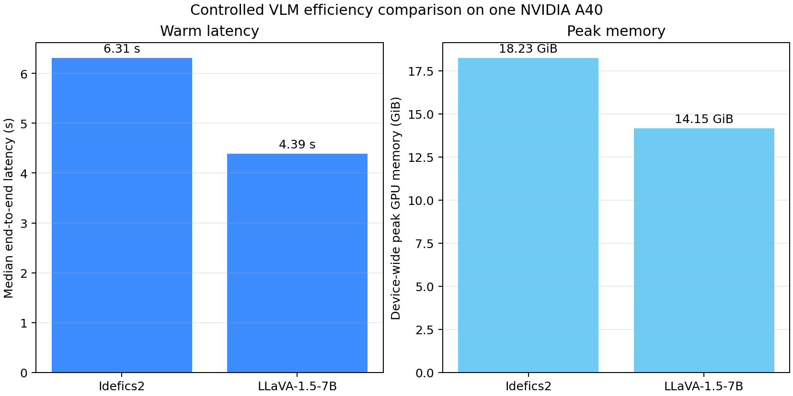

# Week 4 Controlled VLM Architecture Comparison

> Public-image proxy; AI-assisted rubric scores are diagnostic, not human ground truth.

## Controlled protocol

- Models: 2
- Matched requests per model: 60
- Seed: 42
- Frozen variables: image pixels, condition seeds, user prompts, rubric, Judge, and generation policy.
- Changed variable: VLM architecture and its native processor/chat template.

## Quality by condition

| Model | Condition | n parsed | Mean total /5 | Scene /2 | Decision /2 | Uncertainty /1 | Acceptable decision | Forbidden claim |
|---|---|---:|---:|---:|---:|---:|---:|---:|
| idefics2_8b_chatty | clean | 20/20 | 4.900 | 1.950 | 1.950 | 1.000 | 0.950 | 0.000 |
| idefics2_8b_chatty | gaussian_noise_std_0.08 | 20/20 | 4.800 | 1.900 | 1.900 | 1.000 | 0.900 | 0.050 |
| idefics2_8b_chatty | brightness_0.60 | 20/20 | 4.750 | 1.850 | 1.900 | 1.000 | 0.900 | 0.000 |
| llava_1_5_7b_hf | clean | 20/20 | 4.800 | 1.900 | 1.900 | 1.000 | 0.900 | 0.000 |
| llava_1_5_7b_hf | gaussian_noise_std_0.08 | 20/20 | 4.850 | 1.900 | 1.950 | 1.000 | 0.950 | 0.000 |
| llava_1_5_7b_hf | brightness_0.60 | 20/20 | 4.700 | 1.850 | 1.900 | 0.950 | 0.900 | 0.000 |

## Perturbation robustness

| Model | Perturbation | Mean clean-to-perturbed drop | Decision consistency | Eligible scenarios |
|---|---|---:|---:|---:|
| idefics2_8b_chatty | gaussian_noise_std_0.08 | 0.100 | 0.950 | 20 |
| idefics2_8b_chatty | brightness_0.60 | 0.150 | 0.950 | 20 |
| llava_1_5_7b_hf | gaussian_noise_std_0.08 | -0.050 | 0.950 | 20 |
| llava_1_5_7b_hf | brightness_0.60 | 0.100 | 0.900 | 20 |

## Efficiency

| Model | End-to-end p50 / p95 | TTFT p50 | Output tok/s p50 | GPU peak | Model-load peak |
|---|---:|---:|---:|---:|---:|
| idefics2_8b_chatty | 6305.4 / 7281.6 ms | 768.8 ms | 27.87 | 18.23 GiB | 15.96 GiB |
| llava_1_5_7b_hf | 4386.5 / 5966.6 ms | 415.6 ms | 22.68 | 14.15 GiB | 13.47 GiB |

## Figures

## Validity boundary

The same public-image proxies, prompts, perturbations, rubric, Judge, and seed are used for every VLM. Results do not measure deployed products.
