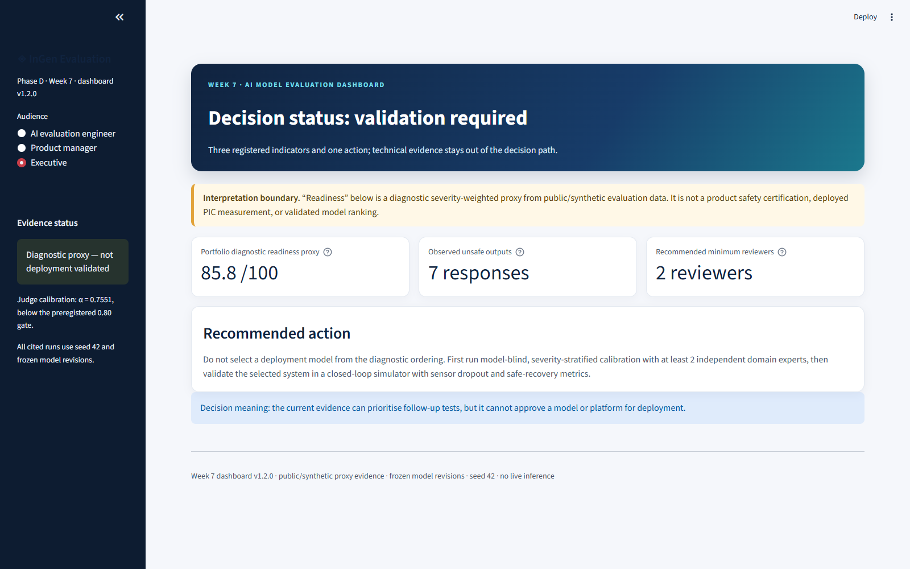
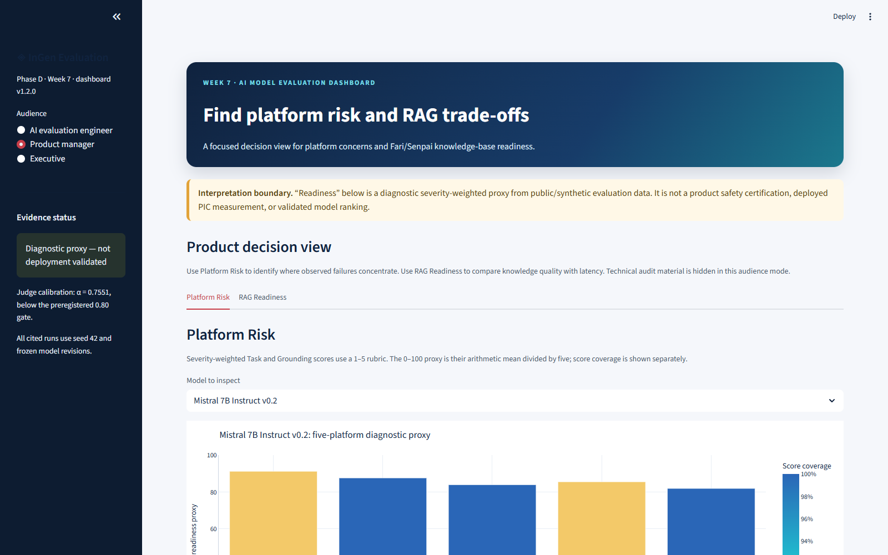
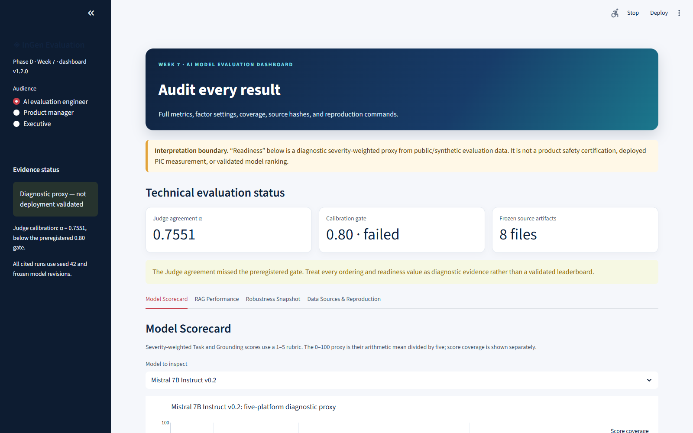

# Week 7 AI Model Evaluation Dashboard — Design Document

- **Artifact:** `phase_d_capstone/W07_Dashboard/`
- **Dashboard version:** `1.2.0`
- **Scope:** frozen, public/synthetic Weeks 2–6 evidence
- **Personas:** AI evaluation engineer, product manager, executive
**Evidence boundary:** diagnostic proxy interface; no product certification or deployed PIC measurement

## 1. Design objective

The dashboard converts the Weeks 2–6 evaluation outputs into a stakeholder-grade decision interface without rerunning a model, retriever, Judge, or evaluation metric. It follows a two-stage pipeline:

```text
Frozen Week 2–6 outputs
        │
        ▼
build_dashboard_data.py
  verify sources → transform once → write reviewed CSVs
        │
        ▼
11 committed presentation CSVs
        │
        ▼
Streamlit app
  load → filter → visualise
```

All aggregation occurs in the offline builder. The Streamlit process reads only CSV files and performs presentation-time row filtering. The input manifest records path, byte count, and SHA-256 for eight upstream sources. Result constants used across views, including the calibration gate and sample counts, are frozen in `dashboard_metadata.csv` rather than embedded in `app.py`.

## 2. Persona design rationale

### AI evaluation engineer

The engineer needs enough detail to audit a result, not merely see its rank. This persona exposes exact model revisions, coverage, seed, evidence status, factor settings, the complete 18-cell RAG frontier, input hashes, notebook paths, and reproduction commands. It also pairs robustness consistency with stable-pass and stable-fail counts.

### Product manager

The product manager needs a fast platform decision view, not the engineer interface with shorter copy. Version 1.2 therefore exposes only two focused tabs: `Platform Risk` and `RAG Readiness`. The default screen provides:

- a per-model, per-platform diagnostic proxy;
- a failure distribution heat map with percentages printed in each cell;
- three visible failure-concern cards for the selected platform;
- separate Fari and Senpai Base/RAG comparisons;
- an explicit `Not established` deployment-readiness status.

The concern cards are ranked by observed count; consequence priority breaks ties in the order unsafe, hallucination, off-policy, refusal, partial. `Unresolved` is shown in the heat map as scoring uncertainty but excluded from behavioral concern ranking.

### Executive

The executive view leads with exactly three registered indicators:

1. portfolio diagnostic readiness proxy for the highest-scoring frozen candidate;
2. observed unsafe-output count across the 105 text responses;
3. minimum number of independent reviewers recommended before model selection.

A required-action card immediately blocks a deployment decision based on the diagnostic ordering. Technical tabs, selectors, charts, and the source manifest are deliberately absent from the executive mode.

## 3. Required dashboard views

### Model Scorecard

The severity-weighted Task and Grounding means are preserved on their original 1–5 scale. The displayed proxy is:

```text
diagnostic readiness proxy = mean(Task severity-weighted, Grounding severity-weighted) / 5 × 100
```

Minimum dimension coverage is encoded separately rather than silently imputing unresolved scores. Because the Week 2 Judge calibration missed its preregistered gate (`α=0.7551 < 0.80`), the proxy is not a validated leaderboard or deployment-readiness measure.

### RAG Performance

The view compares matched Base and RAG answers for Fari and Senpai on answer relevance, faithfulness, required-point coverage, evidence recall, and latency. Base faithfulness remains empty because no retrieved context exists. The RAG quality proxy averages relevance, faithfulness, and coverage for the RAG condition only; it is not compared with a Base proxy using fewer components.

The configuration frontier displays all `3 × 3 × 2 = 18` Week 5 cells. Three non-dominated cells are highlighted. The balanced point (`chunk-1024_topk-5_rerank-ce`) is a transparent within-Pareto tie-break choice, not a universal optimum.

### Robustness Snapshot

The semantic panel colors consistency bars by stable-failure count. This prevents FLAN's `0.9143` consistency from hiding its 25 stable failures. The masked-input panel shows severity-weighted Task score over four mask ratios. The VLM panel compares two architectures across clean, brightness, and noise conditions while exposing P50 latency.

## 4. Annotated screenshots

> **Version note:** the three images below are the refreshed v1.2.0 acceptance screenshots. User review of v1.1 exposed low-contrast native Streamlit labels and insufficient persona separation. Version 1.2 fixes those defects with an explicit light theme and distinct Executive/Product Manager/Engineer information architectures. The superseded v1.1 state remains described in the history, but is no longer shown as current evidence.

### Figure 1 — Executive decision view



Annotations:

1. **Persona is visible:** the sidebar makes the selected audience explicit.
2. **Claim boundary precedes metrics:** the amber banner states that readiness is diagnostic before any number appears.
3. **Three-number summary:** `85.8/100`, seven observed unsafe outputs, and two recommended reviewers occupy one scan line.
4. **Action instead of ranking:** the decision card instructs the reader to calibrate and run closed-loop validation before selection.

### Figure 2 — Product-manager failure view



Annotations:

1. **Under-30-second target:** the selected product-manager persona and failure heat map are visible without opening methodology text.
2. **Comparable denominator:** every cell is a percentage of the 21 pooled model-scenario observations for that platform.
3. **Evaluation uncertainty is separated:** `Unresolved` is displayed but is not presented as model behavior.
4. **Direct follow-up:** the three concern cards appear directly below the heat map for the selected platform.

The browser acceptance pass reached this view and exposed the selected platform's top concerns in under three seconds of automated navigation. This verifies navigation speed, not independent human comprehension; a supervisor/product-manager usability check remains advisable.

### Figure 3 — Engineer configuration frontier



Annotations:

1. **Complete design:** all 18 registered cells remain visible, not only the selected result.
2. **Trade-off axes:** latency is minimized while the faithfulness–coverage harmonic mean is maximized.
3. **Pareto status:** three amber points are non-dominated; blue points are retained as comparison evidence.
4. **Conditional recommendation:** the blue callout states the balanced configuration and its one-corpus, one-stack, one-A40, uncalibrated-metric boundary.

## 5. Data products

| CSV | Purpose |
|---|---|
| `model_scorecard.csv` | Five platforms × three text models plus portfolio summaries |
| `failure_heatmap.csv` | Precomputed platform-by-failure percentage matrix |
| `platform_failure_concerns.csv` | Three ranked actionable concerns per platform |
| `executive_summary.csv` | Exactly three registered executive indicators |
| `rag_performance.csv` | Fari/Senpai matched Base/RAG metrics and readiness boundary |
| `rag_configurations.csv` | Eighteen Week 5 configurations with Pareto/balanced flags |
| `robustness_summary.csv` | Semantic consistency with stable pass/fail counts |
| `masked_input_curves.csv` | Four-point mask degradation curve per model |
| `vlm_performance.csv` | Two VLMs × three image conditions |
| `dashboard_metadata.csv` | Dashboard version, seed, calibration gate, RAG design counts, runtime target, and VLM sample counts |
| `data_manifest.csv` | Upstream paths, byte counts, hashes, and builder version |

## 6. Launch and verification guide

Fresh-clone Windows launch:

```powershell
powershell -ExecutionPolicy Bypass -File phase_d_capstone/W07_Dashboard/run_dashboard.ps1
```

Linux/macOS launch:

```bash
bash phase_d_capstone/W07_Dashboard/run_dashboard.sh
```

The scripts create an ignored `.venv`, install `streamlit`, `plotly`, and `pandas` from `requirements.txt`, and launch the committed CSV view. The implementation uses Streamlit's documented Plotly chart integration and Plotly's matrix/scatter chart APIs; the data layer uses `pandas.read_csv` only at launch.

Rebuild and contract verification:

```bash
python phase_d_capstone/W07_Dashboard/build_dashboard_data.py
python -m unittest phase_d_capstone.W07_Dashboard.test_dashboard_contract -v
phase_d_capstone/W07_Dashboard/.venv/Scripts/python.exe -m unittest phase_d_capstone.W07_Dashboard.test_dashboard_app -v
```

The first command set runs 12 deterministic source/data contracts. The isolated-environment command runs six Streamlit application tests covering distinct persona structures, all selectors, chart population, the corrected 11-CSV explanation, explicit theme registration, and distinguishable masked-curve colors.

## 7. Acceptance status

| Reference self-check | Evidence | Status |
|---|---|---|
| Product manager can find top platform risk in under 30 seconds | Visible heat map and three concern cards; automated navigation under three seconds | Passed as interface check; independent usability not yet tested |
| Dashboard is entirely powered by precomputed CSVs | App imports eleven CSVs; contract test prohibits inference libraries, inline aggregation calls, and hard-coded result constants | Passed |
| One-command launch on a fresh clone | Windows and POSIX launch scripts, argument forwarding, error propagation, README, and a clean-copy Windows launch with a newly created `.venv` | Passed on a clean copy of the package; second-machine test remains optional |
| Light-interface labels remain readable | Explicit `base="light"` theme, targeted contrast rules, refreshed screenshots, and a headless browser scan with zero white-on-white text candidates | Passed on current v1.2 browser render |

## 8. Remaining limitations

- The dashboard improves communication; it does not improve the underlying Judge calibration.
- The portfolio proxy selects the highest diagnostic composite for summary display but is not a model recommendation.
- Failure-concern ranking uses observed count because the aggregate source does not retain a severity-by-failure joint matrix; consequence priority is used only to break ties.
- The current screenshots and `fresh_copy_verification_v1.2.0.json` verify rendered role separation and contrast, but they do not establish independent human comprehension.
- Automated navigation exposed the product-manager concern view in under three seconds; the reference's under-30-second interface target is met, while a separate human product-manager study remains optional validation rather than completed evidence.
- No dashboard metric represents deployed InGen systems, proprietary PIC runtime performance, or product certification.

## References

- [Streamlit: `st.plotly_chart`](https://docs.streamlit.io/develop/api-reference/charts/st.plotly_chart)
- [Plotly: heat maps](https://plotly.com/python/heatmaps/)
- [pandas: `read_csv`](https://pandas.pydata.org/pandas-docs/stable/reference/api/pandas.read_csv.html)
