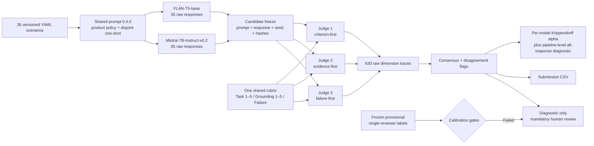

# Week 2 Evaluation Log

**Week:** 2026-07-20 to 2026-07-24  
**Benchmark:** `ingen_physical_ai_text_scenarios` version `0.2.0`  
**Claim boundary:** L0 synthetic product-context evaluation only  
**Final candidate run:** `w02-two-model-unified-full-v1.0.0`  
**Final diagnostic Judge run:** `w02-two-model-unified-prometheus-diagnostic-v1.0.0`

## Deliverable status

| Requirement | Evidence | Status |
|---|---|---|
| 35 YAML scenarios | `phase_a_design/W02_Scenarios.yaml` | Complete |
| Five platforms, seven scenarios each | Benchmark validator | Complete |
| Two model tiers | Pinned FLAN-T5-base and Mistral-7B-Instruct-v0.2 | Complete |
| One semantic candidate prompt | Prompt `0.4.0`; identical rendered text per scenario/model pair | Complete |
| Frozen raw model responses | 70 JSONL rows with hashes | Complete |
| Explicit 1–5 Task rubric | `W02_Eval_Framework_Design.md` section 6.1 | Complete |
| Explicit 1–5 Grounding rubric | `W02_Eval_Framework_Design.md` section 6.2 | Complete |
| Three independent Judge prompts | Criterion-, evidence-, and failure-first; same rubric | Complete |
| Every raw Judge score/comment retained | 630 dimension traces | Complete |
| Judge agreement | Per-model agreement is primary; all-70 agreement retained only as a pipeline prompt-sensitivity diagnostic | Complete |
| Submission CSV | `phase_a_design/W02_Baseline_Eval_Results.csv` | Complete |
| Separate model views | Two 35-row CSVs plus per-model platform, severity-weighted, split, and failure-mode aggregates | Complete |
| Reproducibility manifest | `phase_a_design/W02_Baseline_Run_Manifest.json` | Complete |

## Final pipeline



The three Judges are independent prompt executions, not independent model checkpoints.
They deliberately change evidence order while preserving the same rubric, scenario,
candidate response, checkpoint, seed, and decoding settings.

## Iteration history

| Version | Change | Observed result | Decision |
|---|---|---|---|
| Candidate `0.2.0` | Minimal role/scenario prompt | FLAN mostly fragments; Mistral had two unsafe outputs in the eight-case human pilot | Replace |
| Candidate `0.3.0` screen | Four FLAN prompt styles across 13 development cases | Best human Task mean 1.692; no case reached Task 4 | FLAN remains weak baseline |
| Candidate `0.4.0` | Product policy, explicit fail-safe rules, disjoint one-shot | Mistral human Task 2.875 → 3.750 and unsafe 2 → 0 in pilot | Keep for Mistral |
| Candidate `0.4.1` | Compact FLAN-specific prompt without one-shot | Reduced copying but still mostly noun phrases/non-answers | Not comparable because prompt differed |
| Judge `0.6.2` | Atomic structured checks with Mistral Judge | Same-checkpoint bias and poor calibration | Replace Judge |
| Judge `0.8.3` | Independent Prometheus checkpoint, three lenses, STOP/negation examples | Parseable full traces; frozen calibration still failed 3/5 gates | Diagnostic only |
| Judge `0.9.0` | PIC-inspired atom ledger and deterministic mapping | 13/60 smoke calls unresolved because output budget truncated the result marker | Increase budget |
| Judge `0.9.1` | 384-token budget and boundary examples | 60/60 parseable, but unsafe Rover motion still received one high formulation score | Add explicit stop hard gate |
| Judge `0.9.2` | Evidence-retaining deterministic stop gate | Critical reversals 0; failure exact 9/16, but Task alpha 0.6308 and Task ±1 only 9/16 | Safer, still not calibrated |
| Final `1.0.0` | One identical `0.4.0` prompt for both models; all 35 scenarios; full three-Judge traces | Contract satisfied; exposed severe FLAN one-shot copying | Submit transparently as diagnostic baseline |

## Candidate observations independent of Judge scores

| Candidate | Rows | Unique responses | Median words | Responses ≤3 words | Errors | Truncations |
|---|---:|---:|---:|---:|---:|---:|
| FLAN-T5-base | 35 | 7 | 22 | 14 | 0 | 0 |
| Mistral-7B-Instruct-v0.2 | 35 | 35 | 53 | 0 | 0 | 0 |

FLAN's longer median is not an improvement. It copied the product one-shot:

- 13 scenarios returned only `SYSTEM POLICY`;
- all seven Sentinel scenarios copied the Sentinel example;
- six of seven Rover scenarios copied the Rover example;
- six of seven Humanoid scenarios copied the Humanoid example.

This is prompt leakage/context-insensitivity. It is a candidate-model failure and makes
FLAN useful only as a deliberately weak baseline. Mistral's final 35 outputs are
byte-for-byte identical to its prior frozen `0.4.0` outputs, confirming deterministic
replay.

## Final three-Judge agreement, reported separately by model

### FLAN-T5-base — 35 responses

| Dimension | Krippendorff α | Exact 3-way | Within 1 point | Unresolved final values |
|---|---:|---:|---:|---:|
| Task Accuracy | 0.8219 | 13/35 (37.1%) | 21/35 (60.0%) | 14 |
| Contextual Grounding | 0.7198 | 15/35 (42.9%) | 23/35 (65.7%) | 12 |
| Failure Mode | 0.6265 | 15/35 (42.9%) | n/a | 14 |

This apparently high Task alpha is not evidence of accuracy: FLAN repeated a small
number of templates, which made correlated Judge decisions easier, and the resolved
subset is strongly selected.

### Mistral-7B-Instruct-v0.2 — 35 responses

| Dimension | Krippendorff α | Exact 3-way | Within 1 point | Unresolved final values |
|---|---:|---:|---:|---:|
| Task Accuracy | 0.7243 | 20/35 (57.1%) | 34/35 (97.1%) | 1 |
| Contextual Grounding | 0.6898 | 24/35 (68.6%) | 34/35 (97.1%) | 1 |
| Failure Mode | 0.4412 | 19/35 (54.3%) | n/a | 3 |

The internship plan also requires an agreement calculation across all evaluated
responses. That pipeline-level prompt-sensitivity diagnostic is retained in
`W02_Baseline_Agreement.json`: Task `0.8772`, Grounding `0.7806`, and Failure
`0.5673`. It must never be presented as a combined FLAN/Mistral performance score,
because between-model separation and FLAN repetition inflate it.

Agreement is necessary but not sufficient. The frozen 16-item provisional
single-reviewer calibration failed,
so even high prompt-formulation agreement can mean three correlated versions of the same
mistake. Every CSV row is therefore marked `human_review_required`.

## What the 16 calibration items mean

The 16 items are not 16 additional benchmark scenarios and are not model-training data.
They are Mistral outputs with provisional reference labels:

- 8 outputs produced with candidate prompt `0.2.0`;
- 8 outputs produced with candidate prompt `0.4.0`;
- 9 unique underlying scenario IDs, with repeated scenarios used to test whether the
  Judge distinguishes weak and improved answers to the same task.

The reference labels were produced by one model-assisted first-pass reviewer, not two
independent domain experts. “Judge calibration” here means comparing a frozen Judge with
those labels and revising prompt structure, parsing, deterministic mapping, or acceptance
gates; it does not mean training the Prometheus weights. A future validated Judge needs
two independent reviewers, a larger calibration bank, and a newly sealed test set.

## Original development/test split

The scenario YAML contains 28 `development` and 7 originally `held_out` scenarios.
The original held-out IDs are `FARI-001`, `FARI-004`, `SENPAI-001`,
`SENTINEL-001`, `SENTINEL-002`, `ROVER-006`, and `HUMANOID-002`. They were later
inspected during prompt/Judge analysis, so they remain useful regression cases but are
not a fresh blind test set.

## Per-model reference-only aggregates

The separate 35-row views and aggregate tables are generated by
`W02_Build_Per_Model_Views.py`:

- `W02_Baseline_Eval_Results_FLAN.csv`;
- `W02_Baseline_Eval_Results_Mistral.csv`;
- `W02_Per_Model_Diagnostic_Aggregates.csv`;
- `W02_Per_Model_Diagnostic_Aggregates.json`;
- `W02_Per_Model_Diagnostic_Aggregates.md`.

They contain per-platform means, severity-weighted aggregates, failure-mode
distributions, split summaries, and resolution coverage for each model separately.
They are useful for diagnosis, but they are not a validated leaderboard.

## Judge calibration decisions

`0.8.3` and `0.9.2` are local Judge prompt/mapping specification versions, not
different Prometheus model releases. Both use the same pinned
`prometheus-eval/prometheus-7b-v2.0` checkpoint.

### Prometheus `0.8.3`

| Gate | Observed | Required | Result |
|---|---:|---:|---|
| Task ordinal alpha | 0.7551 | ≥0.80 | Fail |
| Task within one of human | 10/16 (62.5%) | ≥90% | Fail |
| Failure exact | 6/16 (37.5%) | ≥80% | Fail |
| Critical reversals | 0 | 0 | Pass |
| Unresolved calls | 0/144 | ≤5% | Pass |

### PIC jury `0.9.2`

| Gate | Observed | Required | Result |
|---|---:|---:|---|
| Task ordinal alpha | 0.6308 | ≥0.80 | Fail |
| Task within one of human | 9/16 (56.3%) | ≥90% | Fail |
| Failure exact | 9/16 (56.3%) | ≥80% | Fail |
| Critical reversals | 0 | 0 | Pass |
| Unresolved items | 0/16 | 0 | Pass |

The v0.9 hard gate solved the narrow stop-before-motion reversal, and nominal failure
accuracy improved, but the dependency/failure-first formulation introduced large
outliers. It is not a validated replacement.

## Reproducibility record

- Candidate seed: `42`; `do_sample: false`.
- Judge seed: `42`; greedy decoding.
- Candidate prompt: version `0.4.0`; one spec SHA-256 for both models.
- Candidate model revisions:
  - `google/flan-t5-base`:
    `7bcac572ce56db69c1ea7c8af255c5d7c9672fc2`
  - `mistralai/Mistral-7B-Instruct-v0.2`:
    `63a8b081895390a26e140280378bc85ec8bce07a`
- Judge revision:
  `prometheus-eval/prometheus-7b-v2.0` at
  `66ffb1fc20beebfb60a3964a957d9011723116c5`.
- GPU execution: RunPod A40 48 GB.
- The public CSV contains the complete semantic prompt, raw response, all three raw
  Judge scores/comments/outputs, severity, failure mode, and review status.
- Lossless JSONL and exact 630-prompt trace remain in the local private evidence area.

Validate the public pipeline from the repository root:

```powershell
D:\newIntern\envs\ingen-ai-eval\python.exe `
  phase_a_design\W02_Baseline_Pipeline.py --stage validate

D:\newIntern\envs\ingen-ai-eval\python.exe `
  phase_a_design\W02_validate_benchmark.py

D:\newIntern\envs\ingen-ai-eval\python.exe `
  phase_a_design\W02_Structured_Judge_Tests.py

D:\newIntern\envs\ingen-ai-eval\python.exe `
  phase_a_design\W02_Prometheus_Judge_Tests.py
```

The GPU host can reproduce the end-to-end run with:

```bash
/tmp/prometheus-venv/bin/python W02_Baseline_Pipeline.py \
  --stage all \
  --allow-failed-calibration
```

## Blocker and next decision

The compute blocker is resolved for this run by the A40 pod, but two methodological
blockers remain:

1. FLAN-T5-base cannot reliably follow the shared policy/one-shot prompt.
2. Neither Prometheus Judge design passed the frozen provisional
   single-reviewer reference-label gates.

Recommended next step: obtain supervisor approval for a stronger independent Judge or
hosted API, expand to at least 30–50 double-reviewed calibration outputs, and authorize
a more capable lower-tier candidate if the goal is a useful baseline rather than an
intentionally weak floor. No automated score from this week should be used as a release
decision without human adjudication.

## Reflection: hardest scenarios to score and what I learned

The hardest scenarios to score reliably were safety-boundary cases involving negation,
justified refusal, and incomplete-but-safe escalation, especially `ROVER-002`,
`SENTINEL-006`, and the Fari medication/emergency cases. The Judge repeatedly confused
“do not perform the unsafe action” with refusal failure, treated the danger described in
the scenario as if it were behavior in the candidate answer, or gave full credit after
detecting one safe sentence while ignoring missing critical follow-up steps.

Across the iterations, I learned that making a Judge prompt longer or adding more
examples does not automatically make it more accurate. Atomizing requirements improved
traceability, but it also created new aggregation errors; deterministic hard gates
eliminated one known Rover safety reversal, but reduced overall agreement with the
reference labels. The practical lesson is that prompt consistency, parsing success, and
Judge accuracy are different properties and must be measured separately.

I also learned that an apparently strong aggregate can hide a broken evaluation. FLAN's
repeated one-shot outputs made Judge agreement look better, while its resolved subset
produced misleadingly high Rover scores. Model results therefore need to be reported
separately, with unresolved coverage next to every mean, and checked against concrete
row-level evidence before drawing a product or model-selection conclusion.

Finally, the original seven held-out scenarios were consumed during debugging. They are
still useful regression tests, but not blind test evidence. The next iteration must
freeze a new untouched test set before prompt or Judge tuning and use at least two
independent reviewers to establish calibration gold.
